# Графическое дерево документации Art

## Source of truth
- [`../../README.md`](../../README.md)
- [`../../formats/documentation_tree_rules_v0_2.yaml`](../../formats/documentation_tree_rules_v0_2.yaml)
- [`../../formats/documentation_tree_v0_2.yaml`](../../formats/documentation_tree_v0_2.yaml)
- [`../../scripts/ci/generate_documentation_tree.py`](../../scripts/ci/generate_documentation_tree.py)
- [`../../scripts/ci/check_documentation_tree_sync.sh`](../../scripts/ci/check_documentation_tree_sync.sh)

## Назначение
Это отдельный навигационно-контрольный слой документации.

Он не заменяет дерево принятия решений проекта.
Он показывает:
- как документация реально связана от корневого `README.md`;
- сколько документов входит в дерево;
- сколько строк в каждом документе;
- какие каталоговые узлы входят в дерево как самостоятельные сущности;
- какие документы прямо влияют на корневой `README.md`;
- где возможен drift, который требует обновить корневой `README.md`.

## Что даёт этот слой
- быстрый вход в документацию без потери контекста;
- защиту от неучтённых изменений в ключевых документах;
- наглядную карту зависимостей;
- контроль того, что изменения смыслообразующих документов не проходят мимо корневого `README.md`;
- отдельный контроль каталоговых узлов, которые раньше могли выпадать из дерева.

## Сводка
- Корень дерева: [`../../README.md`](../../README.md)
- Строк в корневом `README.md`: `157`
- Уникальных документов в дереве: `65`
- Каталоговых узлов в дереве: `3`
- Общих строк по документным узлам: `9097`
- Суммарных строк внутри каталоговых узлов: `2235`
- Всех связей в дереве: `135`
- Просканированных markdown-ссылок: `145`
- Прямых дочерних ссылок у корня: `36`
- Документов с признаком `ROOT-INFLUENCE`: `17`
- Каталоговых узлов без индексного документа: `0`

## Граф

```mermaid
graph TD
    N1["CHANGELOG.md\n15 строк"]
    N2["README.md\n157 строк"]
    N3["RELEASE_CHECKLIST.md\n25 строк"]
    N4["SECURITY.md\n15 строк"]
    N5["docs/ARCHITECTURE.md\n76 строк"]
    N6["docs/INTEGRATION.md\n47 строк\nROOT-INFLUENCE"]
    N7["docs/README.md\n100 строк\nROOT-INFLUENCE"]
    N8["docs/api/openapi.yaml\n82 строк"]
    N9["docs/contracts/v2/openapi.yaml\n199 строк"]
    N10["docs/contracts/v2/schemas/\nкаталог: 16 файлов\n1073 строк"]
    N11["docs/contracts/v2/schemas/README.md\n29 строк"]
    N12["docs/foundation/ADVANCED_AUTOMATION_BACKLOG.md\n183 строк"]
    N13["docs/foundation/AI_ENGINEERING_OPERATING_MODEL.md\n174 строк"]
    N14["docs/foundation/PROJECT_HISTORY_AND_CONCEPTS.md\n803 строк\nROOT-INFLUENCE"]
    N15["docs/foundation/UNIVERSAL_PROJECT_IDEOLOGY_TEMPLATE.md\n537 строк"]
    N16["docs/foundation/frontier_tech_radar.md\n46 строк"]
    N17["docs/foundation/lens_audit_report.md\n410 строк"]
    N18["docs/foundation/revolutionary_hypotheses.md\n173 строк"]
    N19["docs/governance/evidence/\nкаталог: 44 файлов\n1056 строк"]
    N20["docs/governance/evidence/README.md\n15 строк"]
    N21["docs/governance/evidence/evidence_ledger.yaml\n265 строк"]
    N22["docs/governance/evidence_policy.md\n29 строк"]
    N23["docs/governance/observability_gap_registry.md\n68 строк"]
    N24["docs/governance/release_decisions/\nкаталог: 2 файлов\n106 строк"]
    N25["docs/governance/release_decisions/README.md\n23 строк"]
    N26["docs/governance/release_decisions/latest_go_no_go.md\n83 строк"]
    N27["docs/ops/github_actions_queue_remediation_plan.md\n212 строк"]
    N28["docs/ops/go_no_go_template.md\n129 строк"]
    N29["docs/ops/platform-container-k8s-testing.md\n68 строк"]
    N30["docs/ops/platform-runtime-compatibility-matrix.md\n43 строк"]
    N31["docs/ops/platform-support.md\n98 строк\nROOT-INFLUENCE"]
    N32["docs/ops/platform-vm-testing.md\n54 строк"]
    N33["docs/portal/ART_VISUAL_LANGUAGE.md\n119 строк"]
    N34["docs/portal/COMPATIBILITY_MATRIX_ART_REGART.md\n13 строк"]
    N35["docs/portal/DELIVERY_EVIDENCE.md\n26 строк"]
    N36["docs/portal/DOC_AUTHORITY.md\n19 строк"]
    N37["docs/portal/DOC_STYLE_GUIDE.md\n22 строк"]
    N38["docs/portal/GLOSSARY.md\n14 строк"]
    N39["docs/portal/INDEX.md\n61 строк"]
    N40["docs/portal/PRODUCT_GUARANTEES.md\n14 строк"]
    N41["docs/portal/SECURITY_POSTURE.md\n14 строк"]
    N42["docs/regart/art_bridge_runbook.md\n19 строк"]
    N43["docs/regart/upstream_error_format.md\n29 строк"]
    N44["docs/release/compat_matrix.md\n40 строк"]
    N45["docs/release/release_process.md\n33 строк\nROOT-INFLUENCE"]
    N46["docs/release/versioning.md\n35 строк"]
    N47["docs/security/fstec-certified-profile.md\n30 строк"]
    N48["docs/source/Art_v1_spec_final.md\n614 строк\nROOT-INFLUENCE"]
    N49["docs/source/FOUNDATION_CONSTITUTION_V0_2.md\n693 строк\nROOT-INFLUENCE"]
    N50["docs/source/README.md\n68 строк\nROOT-INFLUENCE"]
    N51["docs/source/REGART -  LangGraph  взаимодействие с Art описание.md\n313 строк\nROOT-INFLUENCE"]
    N52["docs/source/checklists/CHECKLIST_00_MASTER_ART_REGART.md\n307 строк\nROOT-INFLUENCE"]
    N53["docs/source/checklists/CHECKLIST_05_REGART_UI_GRAPH_RUN_DEBUGGER.md\n124 строк"]
    N54["docs/source/checklists/CHECKLIST_06_REGART_ART_BRIDGE.md\n125 строк"]
    N55["docs/source/checklists/CHECKLIST_20_PACK_REGART.md\n125 строк"]
    N56["docs/source/checklists/CHECKLIST_28_CONSOLE_FOUNDATION_MONOREPO.md\n172 строк"]
    N57["docs/source/checklists/CHECKLIST_29_EVENT_DNA_CORE_V2.md\n163 строк"]
    N58["docs/source/checklists/CHECKLIST_30_EVIDENCE_CLAIMS_DIALOGIC_V2.md\n125 строк"]
    N59["docs/source/checklists/CHECKLIST_38_STAGE_LADDER_ENFORCEMENT.md\n78 строк\nROOT-INFLUENCE"]
    N60["docs/source/checklists/README.md\n89 строк"]
    N61["docs/source/dna_core_determinism_performance_assurance.md\n138 строк\nROOT-INFLUENCE"]
    N62["docs/source/risk_register_v0_2.md\n42 строк\nROOT-INFLUENCE"]
    N63["docs/source/secure_actions_protocol_v2.md\n27 строк"]
    N64["docs/testing/defect_remediation_control_matrix_v0_2.md\n424 строк\nROOT-INFLUENCE"]
    N65["docs/testing/defect_remediation_ladder_v0_2.md\n271 строк\nROOT-INFLUENCE"]
    N66["docs/testing/production_adversarial_validation_law.md\n203 строк"]
    N67["docs/testing/test_system_audit_v0_2.md\n97 строк"]
    N68["formats/platform_support.yaml\n253 строк"]
    N2 --> N26
    N2 --> N3
    N2 --> N1
    N2 --> N35
    N2 --> N64
    N2 --> N48
    N2 --> N49
    N2 --> N52
    N2 --> N59
    N2 --> N62
    N2 --> N61
    N2 --> N7
    N2 --> N8
    N2 --> N9
    N2 --> N10
    N2 --> N68
    N2 --> N31
    N2 --> N30
    N2 --> N32
    N2 --> N29
    N2 --> N47
    N2 --> N45
    N2 --> N46
    N2 --> N44
    N2 --> N28
    N2 --> N21
    N2 --> N19
    N2 --> N14
    N2 --> N13
    N2 --> N12
    N2 --> N33
    N2 --> N39
    N2 --> N50
    N2 --> N60
    N2 --> N6
    N2 --> N4
    N5 --> N48
    N5 --> N49
    N5 --> N15
    N5 --> N52
    N5 --> N51
    N5 --> N64
    N5 --> N65
    N5 --> N6
    N6 --> N51
    N6 --> N48
    N6 --> N53
    N6 --> N54
    N6 --> N55
    N6 --> N65
    N6 --> N42
    N6 --> N43
    N7 --> N48
    N7 --> N49
    N7 --> N52
    N7 --> N50
    N7 --> N2
    N7 --> N39
    N7 --> N13
    N7 --> N12
    N7 --> N14
    N7 --> N15
    N7 --> N18
    N7 --> N16
    N7 --> N17
    N7 --> N5
    N7 --> N6
    N7 --> N40
    N7 --> N41
    N7 --> N31
    N7 --> N30
    N7 --> N32
    N7 --> N29
    N7 --> N28
    N7 --> N27
    N7 --> N45
    N7 --> N46
    N7 --> N44
    N7 --> N35
    N7 --> N22
    N7 --> N23
    N7 --> N21
    N7 --> N24
    N7 --> N60
    N7 --> N62
    N7 --> N61
    N7 --> N66
    N7 --> N67
    N10 --> N11
    N11 --> N9
    N11 --> N49
    N11 --> N48
    N11 --> N56
    N11 --> N57
    N11 --> N58
    N15 --> N49
    N15 --> N14
    N15 --> N48
    N15 --> N52
    N19 --> N20
    N24 --> N25
    N39 --> N7
    N39 --> N49
    N39 --> N52
    N39 --> N6
    N39 --> N14
    N39 --> N13
    N39 --> N12
    N39 --> N18
    N39 --> N16
    N39 --> N48
    N39 --> N51
    N39 --> N65
    N39 --> N5
    N39 --> N38
    N39 --> N40
    N39 --> N31
    N39 --> N32
    N39 --> N29
    N39 --> N28
    N39 --> N27
    N39 --> N33
    N39 --> N35
    N39 --> N41
    N39 --> N34
    N39 --> N36
    N39 --> N37
    N39 --> N8
    N39 --> N9
    N39 --> N63
    N39 --> N42
    N44 --> N46
    N44 --> N45
    N44 --> N31
    N44 --> N30
```

## Дерево ссылок
- [`README.md`](../../README.md) — `157` строк
  - [`docs/governance/release_decisions/latest_go_no_go.md`](../governance/release_decisions/latest_go_no_go.md) — `83` строк
  - [`RELEASE_CHECKLIST.md`](../../RELEASE_CHECKLIST.md) — `25` строк
  - [`CHANGELOG.md`](../../CHANGELOG.md) — `15` строк
  - [`docs/portal/DELIVERY_EVIDENCE.md`](DELIVERY_EVIDENCE.md) — `26` строк
  - [`docs/testing/defect_remediation_control_matrix_v0_2.md`](../testing/defect_remediation_control_matrix_v0_2.md) — `424` строк `ROOT-INFLUENCE`
  - [`docs/source/Art_v1_spec_final.md`](../source/Art_v1_spec_final.md) — `614` строк `ROOT-INFLUENCE`
  - [`docs/source/FOUNDATION_CONSTITUTION_V0_2.md`](../source/FOUNDATION_CONSTITUTION_V0_2.md) — `693` строк `ROOT-INFLUENCE`
  - [`docs/source/checklists/CHECKLIST_00_MASTER_ART_REGART.md`](../source/checklists/CHECKLIST_00_MASTER_ART_REGART.md) — `307` строк `ROOT-INFLUENCE`
  - [`docs/source/checklists/CHECKLIST_38_STAGE_LADDER_ENFORCEMENT.md`](../source/checklists/CHECKLIST_38_STAGE_LADDER_ENFORCEMENT.md) — `78` строк `ROOT-INFLUENCE`
  - [`docs/source/risk_register_v0_2.md`](../source/risk_register_v0_2.md) — `42` строк `ROOT-INFLUENCE`
  - [`docs/source/dna_core_determinism_performance_assurance.md`](../source/dna_core_determinism_performance_assurance.md) — `138` строк `ROOT-INFLUENCE`
  - [`docs/README.md`](../README.md) — `100` строк `ROOT-INFLUENCE`
    - [`docs/source/Art_v1_spec_final.md`](../source/Art_v1_spec_final.md) — `614` строк `ROOT-INFLUENCE`
    - [`docs/source/FOUNDATION_CONSTITUTION_V0_2.md`](../source/FOUNDATION_CONSTITUTION_V0_2.md) — `693` строк `ROOT-INFLUENCE`
    - [`docs/source/checklists/CHECKLIST_00_MASTER_ART_REGART.md`](../source/checklists/CHECKLIST_00_MASTER_ART_REGART.md) — `307` строк `ROOT-INFLUENCE`
    - [`docs/source/README.md`](../source/README.md) — `68` строк `ROOT-INFLUENCE`
    - [`README.md`](../../README.md) — `157` строк `REUSED-LINK`
    - [`docs/portal/INDEX.md`](INDEX.md) — `61` строк
      - [`docs/README.md`](../README.md) — `100` строк `ROOT-INFLUENCE` `REUSED-LINK`
      - [`docs/source/FOUNDATION_CONSTITUTION_V0_2.md`](../source/FOUNDATION_CONSTITUTION_V0_2.md) — `693` строк `ROOT-INFLUENCE`
      - [`docs/source/checklists/CHECKLIST_00_MASTER_ART_REGART.md`](../source/checklists/CHECKLIST_00_MASTER_ART_REGART.md) — `307` строк `ROOT-INFLUENCE`
      - [`docs/INTEGRATION.md`](../INTEGRATION.md) — `47` строк `ROOT-INFLUENCE`
        - [`docs/source/REGART -  LangGraph  взаимодействие с Art описание.md`](../source/REGART -  LangGraph  взаимодействие с Art описание.md) — `313` строк `ROOT-INFLUENCE`
        - [`docs/source/Art_v1_spec_final.md`](../source/Art_v1_spec_final.md) — `614` строк `ROOT-INFLUENCE`
        - [`docs/source/checklists/CHECKLIST_05_REGART_UI_GRAPH_RUN_DEBUGGER.md`](../source/checklists/CHECKLIST_05_REGART_UI_GRAPH_RUN_DEBUGGER.md) — `124` строк
        - [`docs/source/checklists/CHECKLIST_06_REGART_ART_BRIDGE.md`](../source/checklists/CHECKLIST_06_REGART_ART_BRIDGE.md) — `125` строк
        - [`docs/source/checklists/CHECKLIST_20_PACK_REGART.md`](../source/checklists/CHECKLIST_20_PACK_REGART.md) — `125` строк
        - [`docs/testing/defect_remediation_ladder_v0_2.md`](../testing/defect_remediation_ladder_v0_2.md) — `271` строк `ROOT-INFLUENCE`
        - [`docs/regart/art_bridge_runbook.md`](../regart/art_bridge_runbook.md) — `19` строк
        - [`docs/regart/upstream_error_format.md`](../regart/upstream_error_format.md) — `29` строк
      - [`docs/foundation/PROJECT_HISTORY_AND_CONCEPTS.md`](../foundation/PROJECT_HISTORY_AND_CONCEPTS.md) — `803` строк `ROOT-INFLUENCE`
      - [`docs/foundation/AI_ENGINEERING_OPERATING_MODEL.md`](../foundation/AI_ENGINEERING_OPERATING_MODEL.md) — `174` строк
      - [`docs/foundation/ADVANCED_AUTOMATION_BACKLOG.md`](../foundation/ADVANCED_AUTOMATION_BACKLOG.md) — `183` строк
      - [`docs/foundation/revolutionary_hypotheses.md`](../foundation/revolutionary_hypotheses.md) — `173` строк
      - [`docs/foundation/frontier_tech_radar.md`](../foundation/frontier_tech_radar.md) — `46` строк
      - [`docs/source/Art_v1_spec_final.md`](../source/Art_v1_spec_final.md) — `614` строк `ROOT-INFLUENCE`
      - [`docs/source/REGART -  LangGraph  взаимодействие с Art описание.md`](../source/REGART -  LangGraph  взаимодействие с Art описание.md) — `313` строк `ROOT-INFLUENCE`
      - [`docs/testing/defect_remediation_ladder_v0_2.md`](../testing/defect_remediation_ladder_v0_2.md) — `271` строк `ROOT-INFLUENCE`
      - [`docs/ARCHITECTURE.md`](../ARCHITECTURE.md) — `76` строк
        - [`docs/source/Art_v1_spec_final.md`](../source/Art_v1_spec_final.md) — `614` строк `ROOT-INFLUENCE`
        - [`docs/source/FOUNDATION_CONSTITUTION_V0_2.md`](../source/FOUNDATION_CONSTITUTION_V0_2.md) — `693` строк `ROOT-INFLUENCE`
        - [`docs/foundation/UNIVERSAL_PROJECT_IDEOLOGY_TEMPLATE.md`](../foundation/UNIVERSAL_PROJECT_IDEOLOGY_TEMPLATE.md) — `537` строк
          - [`docs/source/FOUNDATION_CONSTITUTION_V0_2.md`](../source/FOUNDATION_CONSTITUTION_V0_2.md) — `693` строк `ROOT-INFLUENCE`
          - [`docs/foundation/PROJECT_HISTORY_AND_CONCEPTS.md`](../foundation/PROJECT_HISTORY_AND_CONCEPTS.md) — `803` строк `ROOT-INFLUENCE`
          - [`docs/source/Art_v1_spec_final.md`](../source/Art_v1_spec_final.md) — `614` строк `ROOT-INFLUENCE`
          - [`docs/source/checklists/CHECKLIST_00_MASTER_ART_REGART.md`](../source/checklists/CHECKLIST_00_MASTER_ART_REGART.md) — `307` строк `ROOT-INFLUENCE`
        - [`docs/source/checklists/CHECKLIST_00_MASTER_ART_REGART.md`](../source/checklists/CHECKLIST_00_MASTER_ART_REGART.md) — `307` строк `ROOT-INFLUENCE`
        - [`docs/source/REGART -  LangGraph  взаимодействие с Art описание.md`](../source/REGART -  LangGraph  взаимодействие с Art описание.md) — `313` строк `ROOT-INFLUENCE`
        - [`docs/testing/defect_remediation_control_matrix_v0_2.md`](../testing/defect_remediation_control_matrix_v0_2.md) — `424` строк `ROOT-INFLUENCE`
        - [`docs/testing/defect_remediation_ladder_v0_2.md`](../testing/defect_remediation_ladder_v0_2.md) — `271` строк `ROOT-INFLUENCE`
        - [`docs/INTEGRATION.md`](../INTEGRATION.md) — `47` строк `ROOT-INFLUENCE`
          - [`docs/source/REGART -  LangGraph  взаимодействие с Art описание.md`](../source/REGART -  LangGraph  взаимодействие с Art описание.md) — `313` строк `ROOT-INFLUENCE`
          - [`docs/source/Art_v1_spec_final.md`](../source/Art_v1_spec_final.md) — `614` строк `ROOT-INFLUENCE`
          - [`docs/source/checklists/CHECKLIST_05_REGART_UI_GRAPH_RUN_DEBUGGER.md`](../source/checklists/CHECKLIST_05_REGART_UI_GRAPH_RUN_DEBUGGER.md) — `124` строк
          - [`docs/source/checklists/CHECKLIST_06_REGART_ART_BRIDGE.md`](../source/checklists/CHECKLIST_06_REGART_ART_BRIDGE.md) — `125` строк
          - [`docs/source/checklists/CHECKLIST_20_PACK_REGART.md`](../source/checklists/CHECKLIST_20_PACK_REGART.md) — `125` строк
          - [`docs/testing/defect_remediation_ladder_v0_2.md`](../testing/defect_remediation_ladder_v0_2.md) — `271` строк `ROOT-INFLUENCE`
          - [`docs/regart/art_bridge_runbook.md`](../regart/art_bridge_runbook.md) — `19` строк
          - [`docs/regart/upstream_error_format.md`](../regart/upstream_error_format.md) — `29` строк
      - [`docs/portal/GLOSSARY.md`](GLOSSARY.md) — `14` строк
      - [`docs/portal/PRODUCT_GUARANTEES.md`](PRODUCT_GUARANTEES.md) — `14` строк
      - [`docs/ops/platform-support.md`](../ops/platform-support.md) — `98` строк `ROOT-INFLUENCE`
      - [`docs/ops/platform-vm-testing.md`](../ops/platform-vm-testing.md) — `54` строк
      - [`docs/ops/platform-container-k8s-testing.md`](../ops/platform-container-k8s-testing.md) — `68` строк
      - [`docs/ops/go_no_go_template.md`](../ops/go_no_go_template.md) — `129` строк
      - [`docs/ops/github_actions_queue_remediation_plan.md`](../ops/github_actions_queue_remediation_plan.md) — `212` строк
      - [`docs/portal/ART_VISUAL_LANGUAGE.md`](ART_VISUAL_LANGUAGE.md) — `119` строк
      - [`docs/portal/DELIVERY_EVIDENCE.md`](DELIVERY_EVIDENCE.md) — `26` строк
      - [`docs/portal/SECURITY_POSTURE.md`](SECURITY_POSTURE.md) — `14` строк
      - [`docs/portal/COMPATIBILITY_MATRIX_ART_REGART.md`](COMPATIBILITY_MATRIX_ART_REGART.md) — `13` строк
      - [`docs/portal/DOC_AUTHORITY.md`](DOC_AUTHORITY.md) — `19` строк
      - [`docs/portal/DOC_STYLE_GUIDE.md`](DOC_STYLE_GUIDE.md) — `22` строк
      - [`docs/api/openapi.yaml`](../api/openapi.yaml) — `82` строк
      - [`docs/contracts/v2/openapi.yaml`](../contracts/v2/openapi.yaml) — `199` строк
      - [`docs/source/secure_actions_protocol_v2.md`](../source/secure_actions_protocol_v2.md) — `27` строк
      - [`docs/regart/art_bridge_runbook.md`](../regart/art_bridge_runbook.md) — `19` строк
    - [`docs/foundation/AI_ENGINEERING_OPERATING_MODEL.md`](../foundation/AI_ENGINEERING_OPERATING_MODEL.md) — `174` строк
    - [`docs/foundation/ADVANCED_AUTOMATION_BACKLOG.md`](../foundation/ADVANCED_AUTOMATION_BACKLOG.md) — `183` строк
    - [`docs/foundation/PROJECT_HISTORY_AND_CONCEPTS.md`](../foundation/PROJECT_HISTORY_AND_CONCEPTS.md) — `803` строк `ROOT-INFLUENCE`
    - [`docs/foundation/UNIVERSAL_PROJECT_IDEOLOGY_TEMPLATE.md`](../foundation/UNIVERSAL_PROJECT_IDEOLOGY_TEMPLATE.md) — `537` строк
      - [`docs/source/FOUNDATION_CONSTITUTION_V0_2.md`](../source/FOUNDATION_CONSTITUTION_V0_2.md) — `693` строк `ROOT-INFLUENCE`
      - [`docs/foundation/PROJECT_HISTORY_AND_CONCEPTS.md`](../foundation/PROJECT_HISTORY_AND_CONCEPTS.md) — `803` строк `ROOT-INFLUENCE`
      - [`docs/source/Art_v1_spec_final.md`](../source/Art_v1_spec_final.md) — `614` строк `ROOT-INFLUENCE`
      - [`docs/source/checklists/CHECKLIST_00_MASTER_ART_REGART.md`](../source/checklists/CHECKLIST_00_MASTER_ART_REGART.md) — `307` строк `ROOT-INFLUENCE`
    - [`docs/foundation/revolutionary_hypotheses.md`](../foundation/revolutionary_hypotheses.md) — `173` строк
    - [`docs/foundation/frontier_tech_radar.md`](../foundation/frontier_tech_radar.md) — `46` строк
    - [`docs/foundation/lens_audit_report.md`](../foundation/lens_audit_report.md) — `410` строк
    - [`docs/ARCHITECTURE.md`](../ARCHITECTURE.md) — `76` строк
      - [`docs/source/Art_v1_spec_final.md`](../source/Art_v1_spec_final.md) — `614` строк `ROOT-INFLUENCE`
      - [`docs/source/FOUNDATION_CONSTITUTION_V0_2.md`](../source/FOUNDATION_CONSTITUTION_V0_2.md) — `693` строк `ROOT-INFLUENCE`
      - [`docs/foundation/UNIVERSAL_PROJECT_IDEOLOGY_TEMPLATE.md`](../foundation/UNIVERSAL_PROJECT_IDEOLOGY_TEMPLATE.md) — `537` строк
        - [`docs/source/FOUNDATION_CONSTITUTION_V0_2.md`](../source/FOUNDATION_CONSTITUTION_V0_2.md) — `693` строк `ROOT-INFLUENCE`
        - [`docs/foundation/PROJECT_HISTORY_AND_CONCEPTS.md`](../foundation/PROJECT_HISTORY_AND_CONCEPTS.md) — `803` строк `ROOT-INFLUENCE`
        - [`docs/source/Art_v1_spec_final.md`](../source/Art_v1_spec_final.md) — `614` строк `ROOT-INFLUENCE`
        - [`docs/source/checklists/CHECKLIST_00_MASTER_ART_REGART.md`](../source/checklists/CHECKLIST_00_MASTER_ART_REGART.md) — `307` строк `ROOT-INFLUENCE`
      - [`docs/source/checklists/CHECKLIST_00_MASTER_ART_REGART.md`](../source/checklists/CHECKLIST_00_MASTER_ART_REGART.md) — `307` строк `ROOT-INFLUENCE`
      - [`docs/source/REGART -  LangGraph  взаимодействие с Art описание.md`](../source/REGART -  LangGraph  взаимодействие с Art описание.md) — `313` строк `ROOT-INFLUENCE`
      - [`docs/testing/defect_remediation_control_matrix_v0_2.md`](../testing/defect_remediation_control_matrix_v0_2.md) — `424` строк `ROOT-INFLUENCE`
      - [`docs/testing/defect_remediation_ladder_v0_2.md`](../testing/defect_remediation_ladder_v0_2.md) — `271` строк `ROOT-INFLUENCE`
      - [`docs/INTEGRATION.md`](../INTEGRATION.md) — `47` строк `ROOT-INFLUENCE`
        - [`docs/source/REGART -  LangGraph  взаимодействие с Art описание.md`](../source/REGART -  LangGraph  взаимодействие с Art описание.md) — `313` строк `ROOT-INFLUENCE`
        - [`docs/source/Art_v1_spec_final.md`](../source/Art_v1_spec_final.md) — `614` строк `ROOT-INFLUENCE`
        - [`docs/source/checklists/CHECKLIST_05_REGART_UI_GRAPH_RUN_DEBUGGER.md`](../source/checklists/CHECKLIST_05_REGART_UI_GRAPH_RUN_DEBUGGER.md) — `124` строк
        - [`docs/source/checklists/CHECKLIST_06_REGART_ART_BRIDGE.md`](../source/checklists/CHECKLIST_06_REGART_ART_BRIDGE.md) — `125` строк
        - [`docs/source/checklists/CHECKLIST_20_PACK_REGART.md`](../source/checklists/CHECKLIST_20_PACK_REGART.md) — `125` строк
        - [`docs/testing/defect_remediation_ladder_v0_2.md`](../testing/defect_remediation_ladder_v0_2.md) — `271` строк `ROOT-INFLUENCE`
        - [`docs/regart/art_bridge_runbook.md`](../regart/art_bridge_runbook.md) — `19` строк
        - [`docs/regart/upstream_error_format.md`](../regart/upstream_error_format.md) — `29` строк
    - [`docs/INTEGRATION.md`](../INTEGRATION.md) — `47` строк `ROOT-INFLUENCE`
      - [`docs/source/REGART -  LangGraph  взаимодействие с Art описание.md`](../source/REGART -  LangGraph  взаимодействие с Art описание.md) — `313` строк `ROOT-INFLUENCE`
      - [`docs/source/Art_v1_spec_final.md`](../source/Art_v1_spec_final.md) — `614` строк `ROOT-INFLUENCE`
      - [`docs/source/checklists/CHECKLIST_05_REGART_UI_GRAPH_RUN_DEBUGGER.md`](../source/checklists/CHECKLIST_05_REGART_UI_GRAPH_RUN_DEBUGGER.md) — `124` строк
      - [`docs/source/checklists/CHECKLIST_06_REGART_ART_BRIDGE.md`](../source/checklists/CHECKLIST_06_REGART_ART_BRIDGE.md) — `125` строк
      - [`docs/source/checklists/CHECKLIST_20_PACK_REGART.md`](../source/checklists/CHECKLIST_20_PACK_REGART.md) — `125` строк
      - [`docs/testing/defect_remediation_ladder_v0_2.md`](../testing/defect_remediation_ladder_v0_2.md) — `271` строк `ROOT-INFLUENCE`
      - [`docs/regart/art_bridge_runbook.md`](../regart/art_bridge_runbook.md) — `19` строк
      - [`docs/regart/upstream_error_format.md`](../regart/upstream_error_format.md) — `29` строк
    - [`docs/portal/PRODUCT_GUARANTEES.md`](PRODUCT_GUARANTEES.md) — `14` строк
    - [`docs/portal/SECURITY_POSTURE.md`](SECURITY_POSTURE.md) — `14` строк
    - [`docs/ops/platform-support.md`](../ops/platform-support.md) — `98` строк `ROOT-INFLUENCE`
    - [`docs/ops/platform-runtime-compatibility-matrix.md`](../ops/platform-runtime-compatibility-matrix.md) — `43` строк
    - [`docs/ops/platform-vm-testing.md`](../ops/platform-vm-testing.md) — `54` строк
    - [`docs/ops/platform-container-k8s-testing.md`](../ops/platform-container-k8s-testing.md) — `68` строк
    - [`docs/ops/go_no_go_template.md`](../ops/go_no_go_template.md) — `129` строк
    - [`docs/ops/github_actions_queue_remediation_plan.md`](../ops/github_actions_queue_remediation_plan.md) — `212` строк
    - [`docs/release/release_process.md`](../release/release_process.md) — `33` строк `ROOT-INFLUENCE`
    - [`docs/release/versioning.md`](../release/versioning.md) — `35` строк
    - [`docs/release/compat_matrix.md`](../release/compat_matrix.md) — `40` строк
      - [`docs/release/versioning.md`](../release/versioning.md) — `35` строк
      - [`docs/release/release_process.md`](../release/release_process.md) — `33` строк `ROOT-INFLUENCE`
      - [`docs/ops/platform-support.md`](../ops/platform-support.md) — `98` строк `ROOT-INFLUENCE`
      - [`docs/ops/platform-runtime-compatibility-matrix.md`](../ops/platform-runtime-compatibility-matrix.md) — `43` строк
    - [`docs/portal/DELIVERY_EVIDENCE.md`](DELIVERY_EVIDENCE.md) — `26` строк
    - [`docs/governance/evidence_policy.md`](../governance/evidence_policy.md) — `29` строк
    - [`docs/governance/observability_gap_registry.md`](../governance/observability_gap_registry.md) — `68` строк
    - [`docs/governance/evidence/evidence_ledger.yaml`](../governance/evidence/evidence_ledger.yaml) — `265` строк
    - [`docs/governance/release_decisions/`](../governance/release_decisions/README.md) — `каталог`, файлов `2`, строк `106`
      - [`docs/governance/release_decisions/README.md`](../governance/release_decisions/README.md) — `23` строк
    - [`docs/source/checklists/README.md`](../source/checklists/README.md) — `89` строк
    - [`docs/source/risk_register_v0_2.md`](../source/risk_register_v0_2.md) — `42` строк `ROOT-INFLUENCE`
    - [`docs/source/dna_core_determinism_performance_assurance.md`](../source/dna_core_determinism_performance_assurance.md) — `138` строк `ROOT-INFLUENCE`
    - [`docs/testing/production_adversarial_validation_law.md`](../testing/production_adversarial_validation_law.md) — `203` строк
    - [`docs/testing/test_system_audit_v0_2.md`](../testing/test_system_audit_v0_2.md) — `97` строк
  - [`docs/api/openapi.yaml`](../api/openapi.yaml) — `82` строк
  - [`docs/contracts/v2/openapi.yaml`](../contracts/v2/openapi.yaml) — `199` строк
  - [`docs/contracts/v2/schemas/`](../contracts/v2/schemas/README.md) — `каталог`, файлов `16`, строк `1073`
    - [`docs/contracts/v2/schemas/README.md`](../contracts/v2/schemas/README.md) — `29` строк
      - [`docs/contracts/v2/openapi.yaml`](../contracts/v2/openapi.yaml) — `199` строк
      - [`docs/source/FOUNDATION_CONSTITUTION_V0_2.md`](../source/FOUNDATION_CONSTITUTION_V0_2.md) — `693` строк `ROOT-INFLUENCE`
      - [`docs/source/Art_v1_spec_final.md`](../source/Art_v1_spec_final.md) — `614` строк `ROOT-INFLUENCE`
      - [`docs/source/checklists/CHECKLIST_28_CONSOLE_FOUNDATION_MONOREPO.md`](../source/checklists/CHECKLIST_28_CONSOLE_FOUNDATION_MONOREPO.md) — `172` строк
      - [`docs/source/checklists/CHECKLIST_29_EVENT_DNA_CORE_V2.md`](../source/checklists/CHECKLIST_29_EVENT_DNA_CORE_V2.md) — `163` строк
      - [`docs/source/checklists/CHECKLIST_30_EVIDENCE_CLAIMS_DIALOGIC_V2.md`](../source/checklists/CHECKLIST_30_EVIDENCE_CLAIMS_DIALOGIC_V2.md) — `125` строк
  - [`formats/platform_support.yaml`](../../formats/platform_support.yaml) — `253` строк
  - [`docs/ops/platform-support.md`](../ops/platform-support.md) — `98` строк `ROOT-INFLUENCE`
  - [`docs/ops/platform-runtime-compatibility-matrix.md`](../ops/platform-runtime-compatibility-matrix.md) — `43` строк
  - [`docs/ops/platform-vm-testing.md`](../ops/platform-vm-testing.md) — `54` строк
  - [`docs/ops/platform-container-k8s-testing.md`](../ops/platform-container-k8s-testing.md) — `68` строк
  - [`docs/security/fstec-certified-profile.md`](../security/fstec-certified-profile.md) — `30` строк
  - [`docs/release/release_process.md`](../release/release_process.md) — `33` строк `ROOT-INFLUENCE`
  - [`docs/release/versioning.md`](../release/versioning.md) — `35` строк
  - [`docs/release/compat_matrix.md`](../release/compat_matrix.md) — `40` строк
    - [`docs/release/versioning.md`](../release/versioning.md) — `35` строк
    - [`docs/release/release_process.md`](../release/release_process.md) — `33` строк `ROOT-INFLUENCE`
    - [`docs/ops/platform-support.md`](../ops/platform-support.md) — `98` строк `ROOT-INFLUENCE`
    - [`docs/ops/platform-runtime-compatibility-matrix.md`](../ops/platform-runtime-compatibility-matrix.md) — `43` строк
  - [`docs/ops/go_no_go_template.md`](../ops/go_no_go_template.md) — `129` строк
  - [`docs/governance/evidence/evidence_ledger.yaml`](../governance/evidence/evidence_ledger.yaml) — `265` строк
  - [`docs/governance/evidence/`](../governance/evidence/README.md) — `каталог`, файлов `44`, строк `1056`
    - [`docs/governance/evidence/README.md`](../governance/evidence/README.md) — `15` строк
  - [`docs/foundation/PROJECT_HISTORY_AND_CONCEPTS.md`](../foundation/PROJECT_HISTORY_AND_CONCEPTS.md) — `803` строк `ROOT-INFLUENCE`
  - [`docs/foundation/AI_ENGINEERING_OPERATING_MODEL.md`](../foundation/AI_ENGINEERING_OPERATING_MODEL.md) — `174` строк
  - [`docs/foundation/ADVANCED_AUTOMATION_BACKLOG.md`](../foundation/ADVANCED_AUTOMATION_BACKLOG.md) — `183` строк
  - [`docs/portal/ART_VISUAL_LANGUAGE.md`](ART_VISUAL_LANGUAGE.md) — `119` строк
  - [`docs/portal/INDEX.md`](INDEX.md) — `61` строк
    - [`docs/README.md`](../README.md) — `100` строк `ROOT-INFLUENCE`
      - [`docs/source/Art_v1_spec_final.md`](../source/Art_v1_spec_final.md) — `614` строк `ROOT-INFLUENCE`
      - [`docs/source/FOUNDATION_CONSTITUTION_V0_2.md`](../source/FOUNDATION_CONSTITUTION_V0_2.md) — `693` строк `ROOT-INFLUENCE`
      - [`docs/source/checklists/CHECKLIST_00_MASTER_ART_REGART.md`](../source/checklists/CHECKLIST_00_MASTER_ART_REGART.md) — `307` строк `ROOT-INFLUENCE`
      - [`docs/source/README.md`](../source/README.md) — `68` строк `ROOT-INFLUENCE`
      - [`README.md`](../../README.md) — `157` строк `REUSED-LINK`
      - [`docs/portal/INDEX.md`](INDEX.md) — `61` строк `REUSED-LINK`
      - [`docs/foundation/AI_ENGINEERING_OPERATING_MODEL.md`](../foundation/AI_ENGINEERING_OPERATING_MODEL.md) — `174` строк
      - [`docs/foundation/ADVANCED_AUTOMATION_BACKLOG.md`](../foundation/ADVANCED_AUTOMATION_BACKLOG.md) — `183` строк
      - [`docs/foundation/PROJECT_HISTORY_AND_CONCEPTS.md`](../foundation/PROJECT_HISTORY_AND_CONCEPTS.md) — `803` строк `ROOT-INFLUENCE`
      - [`docs/foundation/UNIVERSAL_PROJECT_IDEOLOGY_TEMPLATE.md`](../foundation/UNIVERSAL_PROJECT_IDEOLOGY_TEMPLATE.md) — `537` строк
        - [`docs/source/FOUNDATION_CONSTITUTION_V0_2.md`](../source/FOUNDATION_CONSTITUTION_V0_2.md) — `693` строк `ROOT-INFLUENCE`
        - [`docs/foundation/PROJECT_HISTORY_AND_CONCEPTS.md`](../foundation/PROJECT_HISTORY_AND_CONCEPTS.md) — `803` строк `ROOT-INFLUENCE`
        - [`docs/source/Art_v1_spec_final.md`](../source/Art_v1_spec_final.md) — `614` строк `ROOT-INFLUENCE`
        - [`docs/source/checklists/CHECKLIST_00_MASTER_ART_REGART.md`](../source/checklists/CHECKLIST_00_MASTER_ART_REGART.md) — `307` строк `ROOT-INFLUENCE`
      - [`docs/foundation/revolutionary_hypotheses.md`](../foundation/revolutionary_hypotheses.md) — `173` строк
      - [`docs/foundation/frontier_tech_radar.md`](../foundation/frontier_tech_radar.md) — `46` строк
      - [`docs/foundation/lens_audit_report.md`](../foundation/lens_audit_report.md) — `410` строк
      - [`docs/ARCHITECTURE.md`](../ARCHITECTURE.md) — `76` строк
        - [`docs/source/Art_v1_spec_final.md`](../source/Art_v1_spec_final.md) — `614` строк `ROOT-INFLUENCE`
        - [`docs/source/FOUNDATION_CONSTITUTION_V0_2.md`](../source/FOUNDATION_CONSTITUTION_V0_2.md) — `693` строк `ROOT-INFLUENCE`
        - [`docs/foundation/UNIVERSAL_PROJECT_IDEOLOGY_TEMPLATE.md`](../foundation/UNIVERSAL_PROJECT_IDEOLOGY_TEMPLATE.md) — `537` строк
          - [`docs/source/FOUNDATION_CONSTITUTION_V0_2.md`](../source/FOUNDATION_CONSTITUTION_V0_2.md) — `693` строк `ROOT-INFLUENCE`
          - [`docs/foundation/PROJECT_HISTORY_AND_CONCEPTS.md`](../foundation/PROJECT_HISTORY_AND_CONCEPTS.md) — `803` строк `ROOT-INFLUENCE`
          - [`docs/source/Art_v1_spec_final.md`](../source/Art_v1_spec_final.md) — `614` строк `ROOT-INFLUENCE`
          - [`docs/source/checklists/CHECKLIST_00_MASTER_ART_REGART.md`](../source/checklists/CHECKLIST_00_MASTER_ART_REGART.md) — `307` строк `ROOT-INFLUENCE`
        - [`docs/source/checklists/CHECKLIST_00_MASTER_ART_REGART.md`](../source/checklists/CHECKLIST_00_MASTER_ART_REGART.md) — `307` строк `ROOT-INFLUENCE`
        - [`docs/source/REGART -  LangGraph  взаимодействие с Art описание.md`](../source/REGART -  LangGraph  взаимодействие с Art описание.md) — `313` строк `ROOT-INFLUENCE`
        - [`docs/testing/defect_remediation_control_matrix_v0_2.md`](../testing/defect_remediation_control_matrix_v0_2.md) — `424` строк `ROOT-INFLUENCE`
        - [`docs/testing/defect_remediation_ladder_v0_2.md`](../testing/defect_remediation_ladder_v0_2.md) — `271` строк `ROOT-INFLUENCE`
        - [`docs/INTEGRATION.md`](../INTEGRATION.md) — `47` строк `ROOT-INFLUENCE`
          - [`docs/source/REGART -  LangGraph  взаимодействие с Art описание.md`](../source/REGART -  LangGraph  взаимодействие с Art описание.md) — `313` строк `ROOT-INFLUENCE`
          - [`docs/source/Art_v1_spec_final.md`](../source/Art_v1_spec_final.md) — `614` строк `ROOT-INFLUENCE`
          - [`docs/source/checklists/CHECKLIST_05_REGART_UI_GRAPH_RUN_DEBUGGER.md`](../source/checklists/CHECKLIST_05_REGART_UI_GRAPH_RUN_DEBUGGER.md) — `124` строк
          - [`docs/source/checklists/CHECKLIST_06_REGART_ART_BRIDGE.md`](../source/checklists/CHECKLIST_06_REGART_ART_BRIDGE.md) — `125` строк
          - [`docs/source/checklists/CHECKLIST_20_PACK_REGART.md`](../source/checklists/CHECKLIST_20_PACK_REGART.md) — `125` строк
          - [`docs/testing/defect_remediation_ladder_v0_2.md`](../testing/defect_remediation_ladder_v0_2.md) — `271` строк `ROOT-INFLUENCE`
          - [`docs/regart/art_bridge_runbook.md`](../regart/art_bridge_runbook.md) — `19` строк
          - [`docs/regart/upstream_error_format.md`](../regart/upstream_error_format.md) — `29` строк
      - [`docs/INTEGRATION.md`](../INTEGRATION.md) — `47` строк `ROOT-INFLUENCE`
        - [`docs/source/REGART -  LangGraph  взаимодействие с Art описание.md`](../source/REGART -  LangGraph  взаимодействие с Art описание.md) — `313` строк `ROOT-INFLUENCE`
        - [`docs/source/Art_v1_spec_final.md`](../source/Art_v1_spec_final.md) — `614` строк `ROOT-INFLUENCE`
        - [`docs/source/checklists/CHECKLIST_05_REGART_UI_GRAPH_RUN_DEBUGGER.md`](../source/checklists/CHECKLIST_05_REGART_UI_GRAPH_RUN_DEBUGGER.md) — `124` строк
        - [`docs/source/checklists/CHECKLIST_06_REGART_ART_BRIDGE.md`](../source/checklists/CHECKLIST_06_REGART_ART_BRIDGE.md) — `125` строк
        - [`docs/source/checklists/CHECKLIST_20_PACK_REGART.md`](../source/checklists/CHECKLIST_20_PACK_REGART.md) — `125` строк
        - [`docs/testing/defect_remediation_ladder_v0_2.md`](../testing/defect_remediation_ladder_v0_2.md) — `271` строк `ROOT-INFLUENCE`
        - [`docs/regart/art_bridge_runbook.md`](../regart/art_bridge_runbook.md) — `19` строк
        - [`docs/regart/upstream_error_format.md`](../regart/upstream_error_format.md) — `29` строк
      - [`docs/portal/PRODUCT_GUARANTEES.md`](PRODUCT_GUARANTEES.md) — `14` строк
      - [`docs/portal/SECURITY_POSTURE.md`](SECURITY_POSTURE.md) — `14` строк
      - [`docs/ops/platform-support.md`](../ops/platform-support.md) — `98` строк `ROOT-INFLUENCE`
      - [`docs/ops/platform-runtime-compatibility-matrix.md`](../ops/platform-runtime-compatibility-matrix.md) — `43` строк
      - [`docs/ops/platform-vm-testing.md`](../ops/platform-vm-testing.md) — `54` строк
      - [`docs/ops/platform-container-k8s-testing.md`](../ops/platform-container-k8s-testing.md) — `68` строк
      - [`docs/ops/go_no_go_template.md`](../ops/go_no_go_template.md) — `129` строк
      - [`docs/ops/github_actions_queue_remediation_plan.md`](../ops/github_actions_queue_remediation_plan.md) — `212` строк
      - [`docs/release/release_process.md`](../release/release_process.md) — `33` строк `ROOT-INFLUENCE`
      - [`docs/release/versioning.md`](../release/versioning.md) — `35` строк
      - [`docs/release/compat_matrix.md`](../release/compat_matrix.md) — `40` строк
        - [`docs/release/versioning.md`](../release/versioning.md) — `35` строк
        - [`docs/release/release_process.md`](../release/release_process.md) — `33` строк `ROOT-INFLUENCE`
        - [`docs/ops/platform-support.md`](../ops/platform-support.md) — `98` строк `ROOT-INFLUENCE`
        - [`docs/ops/platform-runtime-compatibility-matrix.md`](../ops/platform-runtime-compatibility-matrix.md) — `43` строк
      - [`docs/portal/DELIVERY_EVIDENCE.md`](DELIVERY_EVIDENCE.md) — `26` строк
      - [`docs/governance/evidence_policy.md`](../governance/evidence_policy.md) — `29` строк
      - [`docs/governance/observability_gap_registry.md`](../governance/observability_gap_registry.md) — `68` строк
      - [`docs/governance/evidence/evidence_ledger.yaml`](../governance/evidence/evidence_ledger.yaml) — `265` строк
      - [`docs/governance/release_decisions/`](../governance/release_decisions/README.md) — `каталог`, файлов `2`, строк `106`
        - [`docs/governance/release_decisions/README.md`](../governance/release_decisions/README.md) — `23` строк
      - [`docs/source/checklists/README.md`](../source/checklists/README.md) — `89` строк
      - [`docs/source/risk_register_v0_2.md`](../source/risk_register_v0_2.md) — `42` строк `ROOT-INFLUENCE`
      - [`docs/source/dna_core_determinism_performance_assurance.md`](../source/dna_core_determinism_performance_assurance.md) — `138` строк `ROOT-INFLUENCE`
      - [`docs/testing/production_adversarial_validation_law.md`](../testing/production_adversarial_validation_law.md) — `203` строк
      - [`docs/testing/test_system_audit_v0_2.md`](../testing/test_system_audit_v0_2.md) — `97` строк
    - [`docs/source/FOUNDATION_CONSTITUTION_V0_2.md`](../source/FOUNDATION_CONSTITUTION_V0_2.md) — `693` строк `ROOT-INFLUENCE`
    - [`docs/source/checklists/CHECKLIST_00_MASTER_ART_REGART.md`](../source/checklists/CHECKLIST_00_MASTER_ART_REGART.md) — `307` строк `ROOT-INFLUENCE`
    - [`docs/INTEGRATION.md`](../INTEGRATION.md) — `47` строк `ROOT-INFLUENCE`
      - [`docs/source/REGART -  LangGraph  взаимодействие с Art описание.md`](../source/REGART -  LangGraph  взаимодействие с Art описание.md) — `313` строк `ROOT-INFLUENCE`
      - [`docs/source/Art_v1_spec_final.md`](../source/Art_v1_spec_final.md) — `614` строк `ROOT-INFLUENCE`
      - [`docs/source/checklists/CHECKLIST_05_REGART_UI_GRAPH_RUN_DEBUGGER.md`](../source/checklists/CHECKLIST_05_REGART_UI_GRAPH_RUN_DEBUGGER.md) — `124` строк
      - [`docs/source/checklists/CHECKLIST_06_REGART_ART_BRIDGE.md`](../source/checklists/CHECKLIST_06_REGART_ART_BRIDGE.md) — `125` строк
      - [`docs/source/checklists/CHECKLIST_20_PACK_REGART.md`](../source/checklists/CHECKLIST_20_PACK_REGART.md) — `125` строк
      - [`docs/testing/defect_remediation_ladder_v0_2.md`](../testing/defect_remediation_ladder_v0_2.md) — `271` строк `ROOT-INFLUENCE`
      - [`docs/regart/art_bridge_runbook.md`](../regart/art_bridge_runbook.md) — `19` строк
      - [`docs/regart/upstream_error_format.md`](../regart/upstream_error_format.md) — `29` строк
    - [`docs/foundation/PROJECT_HISTORY_AND_CONCEPTS.md`](../foundation/PROJECT_HISTORY_AND_CONCEPTS.md) — `803` строк `ROOT-INFLUENCE`
    - [`docs/foundation/AI_ENGINEERING_OPERATING_MODEL.md`](../foundation/AI_ENGINEERING_OPERATING_MODEL.md) — `174` строк
    - [`docs/foundation/ADVANCED_AUTOMATION_BACKLOG.md`](../foundation/ADVANCED_AUTOMATION_BACKLOG.md) — `183` строк
    - [`docs/foundation/revolutionary_hypotheses.md`](../foundation/revolutionary_hypotheses.md) — `173` строк
    - [`docs/foundation/frontier_tech_radar.md`](../foundation/frontier_tech_radar.md) — `46` строк
    - [`docs/source/Art_v1_spec_final.md`](../source/Art_v1_spec_final.md) — `614` строк `ROOT-INFLUENCE`
    - [`docs/source/REGART -  LangGraph  взаимодействие с Art описание.md`](../source/REGART -  LangGraph  взаимодействие с Art описание.md) — `313` строк `ROOT-INFLUENCE`
    - [`docs/testing/defect_remediation_ladder_v0_2.md`](../testing/defect_remediation_ladder_v0_2.md) — `271` строк `ROOT-INFLUENCE`
    - [`docs/ARCHITECTURE.md`](../ARCHITECTURE.md) — `76` строк
      - [`docs/source/Art_v1_spec_final.md`](../source/Art_v1_spec_final.md) — `614` строк `ROOT-INFLUENCE`
      - [`docs/source/FOUNDATION_CONSTITUTION_V0_2.md`](../source/FOUNDATION_CONSTITUTION_V0_2.md) — `693` строк `ROOT-INFLUENCE`
      - [`docs/foundation/UNIVERSAL_PROJECT_IDEOLOGY_TEMPLATE.md`](../foundation/UNIVERSAL_PROJECT_IDEOLOGY_TEMPLATE.md) — `537` строк
        - [`docs/source/FOUNDATION_CONSTITUTION_V0_2.md`](../source/FOUNDATION_CONSTITUTION_V0_2.md) — `693` строк `ROOT-INFLUENCE`
        - [`docs/foundation/PROJECT_HISTORY_AND_CONCEPTS.md`](../foundation/PROJECT_HISTORY_AND_CONCEPTS.md) — `803` строк `ROOT-INFLUENCE`
        - [`docs/source/Art_v1_spec_final.md`](../source/Art_v1_spec_final.md) — `614` строк `ROOT-INFLUENCE`
        - [`docs/source/checklists/CHECKLIST_00_MASTER_ART_REGART.md`](../source/checklists/CHECKLIST_00_MASTER_ART_REGART.md) — `307` строк `ROOT-INFLUENCE`
      - [`docs/source/checklists/CHECKLIST_00_MASTER_ART_REGART.md`](../source/checklists/CHECKLIST_00_MASTER_ART_REGART.md) — `307` строк `ROOT-INFLUENCE`
      - [`docs/source/REGART -  LangGraph  взаимодействие с Art описание.md`](../source/REGART -  LangGraph  взаимодействие с Art описание.md) — `313` строк `ROOT-INFLUENCE`
      - [`docs/testing/defect_remediation_control_matrix_v0_2.md`](../testing/defect_remediation_control_matrix_v0_2.md) — `424` строк `ROOT-INFLUENCE`
      - [`docs/testing/defect_remediation_ladder_v0_2.md`](../testing/defect_remediation_ladder_v0_2.md) — `271` строк `ROOT-INFLUENCE`
      - [`docs/INTEGRATION.md`](../INTEGRATION.md) — `47` строк `ROOT-INFLUENCE`
        - [`docs/source/REGART -  LangGraph  взаимодействие с Art описание.md`](../source/REGART -  LangGraph  взаимодействие с Art описание.md) — `313` строк `ROOT-INFLUENCE`
        - [`docs/source/Art_v1_spec_final.md`](../source/Art_v1_spec_final.md) — `614` строк `ROOT-INFLUENCE`
        - [`docs/source/checklists/CHECKLIST_05_REGART_UI_GRAPH_RUN_DEBUGGER.md`](../source/checklists/CHECKLIST_05_REGART_UI_GRAPH_RUN_DEBUGGER.md) — `124` строк
        - [`docs/source/checklists/CHECKLIST_06_REGART_ART_BRIDGE.md`](../source/checklists/CHECKLIST_06_REGART_ART_BRIDGE.md) — `125` строк
        - [`docs/source/checklists/CHECKLIST_20_PACK_REGART.md`](../source/checklists/CHECKLIST_20_PACK_REGART.md) — `125` строк
        - [`docs/testing/defect_remediation_ladder_v0_2.md`](../testing/defect_remediation_ladder_v0_2.md) — `271` строк `ROOT-INFLUENCE`
        - [`docs/regart/art_bridge_runbook.md`](../regart/art_bridge_runbook.md) — `19` строк
        - [`docs/regart/upstream_error_format.md`](../regart/upstream_error_format.md) — `29` строк
    - [`docs/portal/GLOSSARY.md`](GLOSSARY.md) — `14` строк
    - [`docs/portal/PRODUCT_GUARANTEES.md`](PRODUCT_GUARANTEES.md) — `14` строк
    - [`docs/ops/platform-support.md`](../ops/platform-support.md) — `98` строк `ROOT-INFLUENCE`
    - [`docs/ops/platform-vm-testing.md`](../ops/platform-vm-testing.md) — `54` строк
    - [`docs/ops/platform-container-k8s-testing.md`](../ops/platform-container-k8s-testing.md) — `68` строк
    - [`docs/ops/go_no_go_template.md`](../ops/go_no_go_template.md) — `129` строк
    - [`docs/ops/github_actions_queue_remediation_plan.md`](../ops/github_actions_queue_remediation_plan.md) — `212` строк
    - [`docs/portal/ART_VISUAL_LANGUAGE.md`](ART_VISUAL_LANGUAGE.md) — `119` строк
    - [`docs/portal/DELIVERY_EVIDENCE.md`](DELIVERY_EVIDENCE.md) — `26` строк
    - [`docs/portal/SECURITY_POSTURE.md`](SECURITY_POSTURE.md) — `14` строк
    - [`docs/portal/COMPATIBILITY_MATRIX_ART_REGART.md`](COMPATIBILITY_MATRIX_ART_REGART.md) — `13` строк
    - [`docs/portal/DOC_AUTHORITY.md`](DOC_AUTHORITY.md) — `19` строк
    - [`docs/portal/DOC_STYLE_GUIDE.md`](DOC_STYLE_GUIDE.md) — `22` строк
    - [`docs/api/openapi.yaml`](../api/openapi.yaml) — `82` строк
    - [`docs/contracts/v2/openapi.yaml`](../contracts/v2/openapi.yaml) — `199` строк
    - [`docs/source/secure_actions_protocol_v2.md`](../source/secure_actions_protocol_v2.md) — `27` строк
    - [`docs/regart/art_bridge_runbook.md`](../regart/art_bridge_runbook.md) — `19` строк
  - [`docs/source/README.md`](../source/README.md) — `68` строк `ROOT-INFLUENCE`
  - [`docs/source/checklists/README.md`](../source/checklists/README.md) — `89` строк
  - [`docs/INTEGRATION.md`](../INTEGRATION.md) — `47` строк `ROOT-INFLUENCE`
    - [`docs/source/REGART -  LangGraph  взаимодействие с Art описание.md`](../source/REGART -  LangGraph  взаимодействие с Art описание.md) — `313` строк `ROOT-INFLUENCE`
    - [`docs/source/Art_v1_spec_final.md`](../source/Art_v1_spec_final.md) — `614` строк `ROOT-INFLUENCE`
    - [`docs/source/checklists/CHECKLIST_05_REGART_UI_GRAPH_RUN_DEBUGGER.md`](../source/checklists/CHECKLIST_05_REGART_UI_GRAPH_RUN_DEBUGGER.md) — `124` строк
    - [`docs/source/checklists/CHECKLIST_06_REGART_ART_BRIDGE.md`](../source/checklists/CHECKLIST_06_REGART_ART_BRIDGE.md) — `125` строк
    - [`docs/source/checklists/CHECKLIST_20_PACK_REGART.md`](../source/checklists/CHECKLIST_20_PACK_REGART.md) — `125` строк
    - [`docs/testing/defect_remediation_ladder_v0_2.md`](../testing/defect_remediation_ladder_v0_2.md) — `271` строк `ROOT-INFLUENCE`
    - [`docs/regart/art_bridge_runbook.md`](../regart/art_bridge_runbook.md) — `19` строк
    - [`docs/regart/upstream_error_format.md`](../regart/upstream_error_format.md) — `29` строк
  - [`SECURITY.md`](../../SECURITY.md) — `15` строк

## Документы, влияющие на корневой README
Если изменяется любой документ из этого списка, а `README.md` не изменён, CI подаёт сигнал о рассинхроне.

- [`docs/INTEGRATION.md`](../INTEGRATION.md) — `47` строк
- [`docs/README.md`](../README.md) — `100` строк
- [`docs/foundation/PROJECT_HISTORY_AND_CONCEPTS.md`](../foundation/PROJECT_HISTORY_AND_CONCEPTS.md) — `803` строк
- [`docs/ops/platform-support.md`](../ops/platform-support.md) — `98` строк
- [`docs/release/release_process.md`](../release/release_process.md) — `33` строк
- [`docs/source/Art_v1_spec_final.md`](../source/Art_v1_spec_final.md) — `614` строк
- [`docs/source/FOUNDATION_CONSTITUTION_V0_2.md`](../source/FOUNDATION_CONSTITUTION_V0_2.md) — `693` строк
- [`docs/source/README.md`](../source/README.md) — `68` строк
- [`docs/source/REGART -  LangGraph  взаимодействие с Art описание.md`](../source/REGART -  LangGraph  взаимодействие с Art описание.md) — `313` строк
- [`docs/source/checklists/CHECKLIST_00_MASTER_ART_REGART.md`](../source/checklists/CHECKLIST_00_MASTER_ART_REGART.md) — `307` строк
- [`docs/source/checklists/CHECKLIST_38_STAGE_LADDER_ENFORCEMENT.md`](../source/checklists/CHECKLIST_38_STAGE_LADDER_ENFORCEMENT.md) — `78` строк
- `docs/source/checklists/TRACEABILITY_V0_2.md` — `НЕ ПОПАЛ В ДЕРЕВО`
- [`docs/source/dna_core_determinism_performance_assurance.md`](../source/dna_core_determinism_performance_assurance.md) — `138` строк
- [`docs/source/risk_register_v0_2.md`](../source/risk_register_v0_2.md) — `42` строк
- [`docs/testing/defect_remediation_control_matrix_v0_2.md`](../testing/defect_remediation_control_matrix_v0_2.md) — `424` строк
- [`docs/testing/defect_remediation_ladder_v0_2.md`](../testing/defect_remediation_ladder_v0_2.md) — `271` строк
- `formats/defect_remediation_control_matrix_v0_2.yaml` — `НЕ ПОПАЛ В ДЕРЕВО`

## Каталоговые узлы
Это специальные узлы дерева для ссылок на каталоги. Они считаются автоматически и показывают:
- сколько файлов внутри;
- сколько строк внутри;
- есть ли индексный документ, на который можно безопасно сослаться.

- [`docs/contracts/v2/schemas/`](../contracts/v2/schemas/README.md) — файлов `16`, строк `1073`
- [`docs/governance/evidence/`](../governance/evidence/README.md) — файлов `44`, строк `1056`
- [`docs/governance/release_decisions/`](../governance/release_decisions/README.md) — файлов `2`, строк `106`

## Каталоговые узлы без индексного документа
Если здесь появляется запись, дерево считается дефектным: каталог есть в ссылках, но не имеет реального индексного документа.

- нет

## Missing targets
Если здесь появится запись, значит в документации есть ссылка на файл, который не найден.

- нет

## Статус
- Статус дерева: `ACTIVE`
- Корень документационного дерева: `README.md`
- Контроль рассинхрона: `ENABLED`
